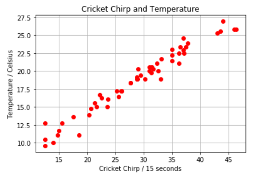
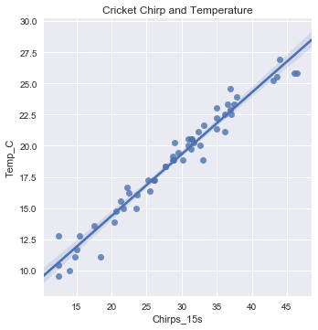

# অংকে মেশিন লার্নিং, ২


খবরদার! কোডের দিকে ভুলেও তাকাবেন না। কারণ, এখনো সময় আসেনি। ছবিগুলোর পরে কোডগুলো দেবার কারণ হচ্ছে পরবর্তী চ্যাপ্টারগুলো পড়ে আসার পর যাতে বুঝতে পারেন কিভাবে কি হচ্ছে।   
আমি নিজেও প্রচুর বইতে দেখেছি - শুরুর দিকের ছবিগুলোতে লেখকেরা ইচ্ছে করে কোড দেন না। 'কমপ্লেক্সিটি' এড়ানোর জন্য হয়তোবা উনারা সেটা করেন না। কিন্তু, দেখা যায় - পরে আর ওই কোডের খবর থাকে না। আমি দিয়ে দিচ্ছি, তবে এখন  তাকানো নিষেধ। 


দাদা অবশ্য রাত অবধি পর্যন্ত বাড়তে দেননি এই গল্পের আসরকে। সবাইকে প্রায় জোর করেই পাঠিয়েছিলেন ঘুমোতে। আগ্রহী বাচ্চাদেরকে সকালের নাস্তার পর বসতে বলেছিলেন ফুঁপিমার সাথে। মানে, ওই অংকের কেরামতি জানতে। ছোট্ট রকিব অবশ্য ঘুমোতে পারেনি সারারাত। এপাশ-ওপাশ করে কাটিয়েছে পুরো সময়টা বিছানায়। উত্তেজনায়। কিভাবে হলো ব্যাপারটা? মানে, ঝিঁঝিঁ পোকা কিভাবে জানলো তাপমাত্রার কথা। আর ঝিঁঝিঁ পোকার ডাককেই বা কিভাবে মেলানো যাচ্ছে অংকের সাথে? তাহলে কি বছরের যেকোনো সময়ে এই ঝিঁঝিঁ পোকার ডাক শুনে জানা যাবে তখনকার তাপমাত্রা কথা? পুরো ব্যাপারটাই বা ঘটছে কিভাবে? সম্পর্কটা কোথায়?

ভোর পর্যন্ত অনেক কষ্টে আটকে রেখেছিল নিজেকে বিছানার সাথে। কোকিলের এক ডাকেই বিছানা ছাড়লো সে। ভোরের ঠান্ডা হাওয়ায় পুরো পুকুরটা একবার ঘুরে আসতেই বাড়ির উঠোনে দেখা হয়ে গেল ফুঁপিমার সাথে। বসে আছেন টেবিলে। একা। চুল ছাড়া। একটা খাতা সামনে। এদিকে সবাই এখনো ঘুমে। সূর্য উঠবে, নাস্তা হবে - তারপর না অংকের আলাপ।

“কেমন ঘুম হলো তোর? শহুরে বাবু।” ফুঁপিমা বললেন। মুখে প্রশয়ের হাসি। মন ভালো থাকলে মাঝে মাঝে রকিবকে ‘শহুরে বাবু’ বলে ডাকেন উনি। নিজেকে আটকে রাখতে পারল না ছোট্ট রকিব। গড় গড় করে বুকের ভেতরের সব প্রশ্নগুলো বলে ফেলল এক মুহূর্তে। ও ভালোভাবেই জানে যে প্রশ্নগুলো করা উচিত ছিল নাস্তার পরে। সেজন্যই তো পুরো পুকুর ঘুরতে গিয়েছিলো মন শান্ত করার জন্য। কিন্তু আটকাতে পারলোনা সে। কতই বা বয়স তার? তখন পড়ছে মাত্র ক্লাস সিক্সে। ক্যাডেট কলেজে যাবার আগে আগে। রাতজাগা বিধ্বস্ত চেহারা দেখে মায়া হল ফুঁপিমার। ওর অনুসন্ধিৎসু মনের খবর জানেন উনি।

“চেয়ার টেনে বস পন্ডিত।” বললেন ফুঁপিমা। শোন, পৃথিবীতে প্রতিটা জিনিসের একটা ‘প্যাটার্ন’ আছে। এই যেমন - রাতের পর দিন আসছে - আবার দিনের পর রাত। এটা একটা সহজ প্যাটার্ন। গ্রহ নক্ষত্র একটা প্যাটার্নে ঘোরে। প্যাটার্ন না মানলে সব শেষ। এদিকে ইলেকট্রন প্রোটন এক প্যাটার্নে ঘোরে। মানুষ জন্মায় তারপর একসময় চলে যায়। আবার নতুন মানুষ আসে এই পৃথিবীতে। এই যে তুই গ্রামে এলি সেটাও একটা প্যাটার্ন। আমপাকা গরমের ছুটিতে আসিস তুই। সৃষ্টিকর্তা মানুষকে শিখিয়েছেন অনেক কিছু। তোর কি মনে হয় - ‘প্যাটার্ন’ ধরার টেকনিকটা শেখাননি উনি?

প্রশ্ন শুনে ভ্যাবাচ্যাঁকা খেয়ে গেল ও। “কিভাবে?” ছোট্ট রকিব এর প্রশ্ন। আবার বললো “কিভাবে ফুঁপিমা?”

এই পাতাটা একটু ভালভাবে দেখ। উনার খাতাটা খুলে ভেতরের একটা পাতা বের করলেন উনি। ছোট্ট একটা টেবিল দেখা যাচ্ছে এপাশ থেকে। প্রথম সারিতে অনেকগুলো তারিখ লেখা। পরের সারিতে ঝিঁঝিঁ পোকার ডাক এর সংখ্যা। প্রতি ১৫ সেকেন্ডের। তার পরের সারিতে ডাকার সময়ের তাপমাত্রা লিখে রেখেছেন ফুঁপিমা। ৫০টার কিছু বেশি রেকর্ড রেখেছেন উনি। 

| Date | Chirp\_15s | Temp\_C |
| :--- | :--- | :--- |
| 21-Aug | 44 | 26.94 |
| 21-Aug | 46.4 | 25.83 |

“আয় কাগজে একটু প্লটিং করি।” উনি পেন্সিল দিয়ে ইশারা করলেন। ঝিঁঝিঁ পোকার ডাক আর তাপমাত্রার একটা 'কো-রিলেশন' বের করতে পারলেই আমাদের কাজ শেষ। 

রকিব আর সামলাতে পারল না তাকে। বলল, “প্লট করলে কি পাবো আমরা?” ফুঁপিমা মা হাসলেন। বললেন, “প্যাটার্ন। আমরা একটা প্যাটার্ন পাব।” খাতা থেকে ডাটাগুলো নিয়ে নিচের মতো করে একটা ছবি আঁকলেন উনি। একপাশে ১৫ সেকেন্ডের ঝিঁঝি পোকার ডাক, আরেকপাশে সেই সময়ের তাপমাত্রা। নিচের ছবির মতো “এক্স এক্সিসে” ডাকের সংখ্যা - “ওয়াই এক্সিস” এ তাপমাত্রা প্লট করেছেন উনি গ্রিড ধরে ধরে। ঝিঁঝি পোকার ডাকের সংখ্যার সাথে ওই তাপমাত্রার একেকটা ডট। শুরুতে ৪৪টা ঝিঁঝি পোকার ডাক ২৬.৯৬ ডিগ্রী তাপমাত্রায় যেখানে মিলেছে সেখানে একটা ডট। এভাবে ৫৫টা ডট দেয়া হলো ওই কাগজে। 



“এতো অসম্ভব ব্যাপার। মোটামুটি একটা লাইন হয়ে গেছি দেখছি।” অবাক হয়ে বললো ছোট্ট রকিব।

“ঠিক ধরেছিস। এটাই প্যাটার্ন। অংকের ভাষায় "বেস্ট ফিট লাইন"। এটাই খুঁজেছি বছরখানেক ধরে। বেশি ডাক দেয়া মানে হচ্ছে তাপমাত্রাও বেশি। সেটা বাড়ছে এক লাইনে। এখন কাজ সোজা। সরল রেখা মানে আমাদের উত্তর হচ্ছে লিনিয়ার। এটাই জানা জরুরি ছিলো।” বললেন ফুঁপিমা। 

"এই ডটগুলো ধরে একটা লাইন টানি বরং।" বলে নিজেই একটা লাইন টানলেন। এখন তুই নিজেই বলতে পারবি অংক ছাড়া। এই গ্রাফ দিয়ে। 



এখন ১৫ সেকেন্ডে ২৫ বার ডেকে ফেললে কতো তাপমাত্রা হবে বল দেখি? ফুঁপিমা তাকালেন ছোট্ট রকিবের দিকে। ২৫ সংখ্যাটা পেন্সিল দিয়ে দেখালেন এক্স এক্সিসে। 

ফিক করে হেসে ফেললো রকিব। দাগটা ওয়াই এক্সিসের ১৭.৫ ডিগ্রীর একটু নিচ দিয়ে গিয়েছে। কি বলবে বুঝতে না পেরে গম্ভীরভাবে বললো "১৭ ডিগ্রী।" 

"ঠিক ধরেছিস। বুদ্ধি আছে তোর। বড় হয়ে অংক ছাড়িস না কিন্তু।"  বললেন ফুঁপিমা। 

"আচ্ছা, মনে আছে সরল রেখার কথা?” প্রশ্ন করলেন উনি।

“হ্যাঁ।” উত্তর দিলো ছোট্ট রকিব।

ফুঁপিমা একটু জোর দিয়ে বললেন, “মানে সরল রেখার ওই অ্যালজেব্রার ইকুয়েশনের কথা?”


রকিবের কাছে এখনো ওই খাতাটা আছে। একজন ডাটা সাইন্টিস্ট সে এখন। ওই ডাটা প্লট করা এখন কয়েক মিনিটের ব্যাপার। প্রথমটা ডাটা প্লটিং, পরেরটা একটা দাগ টানা। দুটো একভাবেই করা যেতো। বৈচিত্র্য আনা, এই যা! 


```text
# import matplotlib for plotting a graph
import matplotlib.pyplot as plt

# here we plot 'Temperature / Celsius' in X axis and 'Cricket Chirp / 15 seconds' in Y axis
x = [26.944, 25.833, 25.556, 23.056, 21.389, 20.000, 18.889, 18.333, 16.389, 13.889, 12.778, 24.583, 23.333, 23.333, 22.500, 18.889, 25.278, 25.833, 20.278, 20.278, 20.000, 18.889, 15.000, 21.111, 20.556, 19.444, 16.250, 14.722, 22.222, 21.667, 20.556, 19.167, 15.556, 23.889, 22.917, 22.500, 21.111, 19.722, 18.889, 20.556, 17.222, 17.222, 16.111, 16.667, 13.611, 12.778, 11.111, 11.667, 10.000, 11.111, 18.333, 17.222, 15.000, 10.417, 9.5833]
y = [44.000,46.400,43.600,35.000,35.000,32.600,28.900,27.700,25.500,20.375,12.500,37.000,37.500,36.500,36.200,33.000,43.000,46.000,29.000,31.700,31.000,28.750,23.500,32.400,31.000,29.500,22.500,20.600,35.000,33.100,31.500,28.800,21.300,37.800,37.000,37.100,36.200,31.400,30.200,31.300,26.100,25.200,23.660,22.250,17.500,15.500,14.750,15.000,14.000,18.500,27.700,26.000,21.700,12.500,12.500]

# title and labeling X and Y axis
plt.xlabel('Cricket Chirp / 15 seconds')
plt.ylabel('Temperature / Celsius')
plt.title('Cricket Chirp and Temperature')
plt.grid(True)
plt.plot(x,y, 'ro')
plt.show()
```

```text
# we import seaborn, my favourite visualization library
import seaborn as sns; sns.set(color_codes=True)
import pandas as pd
# Load CSV and columns
chirp_data = pd.read_csv("Documents/chirps.csv")

g = sns.lmplot(x="Chirps_15s", y="Temp_C", data=chirp_data)
plt.title('Cricket Chirp and Temperature')
plt.show()
```

