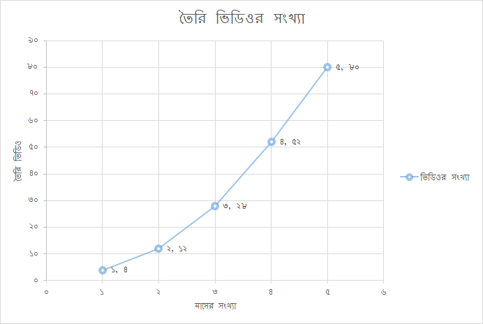

# অংকে মেশিন লার্নিং ৪, লিনিয়ার রিগ্রেশন

> It is a capital mistake to theorize before one has data.
>
> -- Sherlock Holmes, “A Study in Scarlett”


ঝিঁঝিঁপোকার থার্মোমিটারের ডেটাসেটটাতে ৫৫টা রেকর্ড আছে বলে সেটার অংক নিয়ে আসবো "মডেলের কার্যকারীতা \(ইভ্যালুয়েশন\)" অধ্যায়ে। পাইথন দিয়ে। মেশিন লার্নিং মডেলে। তার আগে একদম ছোট্ট একটা উদাহরণ দিলে বুঝতে সুবিধা হবে। 


অফিস, বাসার কাজের পাশাপাশি রেডিও ডিজাইন, পিএইচডি, বই লেখার সাথে যোগ হয়েছে অডিও ভিডিও পোস্ট প্রসেসিং। একটা ৩ মিনিটের ভিডিও নামাতে শুরুতে লাগতো দু সপ্তাহ। তবে যোগ হতে থাকলো বিভিন্ন অ্যাপ্লিকেশন টেমপ্লেট। অপটিমাইজেশন যোগ হচ্ছে বিভিন্ন প্রসেসে। কিছু কিছু জিনিস চলে গেছে ব্যাচ প্রসেসিংয়ে। নতুন নতুন হার্ডওয়্যার কানেক্ট হচ্ছে হোম ষ্টুডিওতে। গত পাঁচ মাসের ভিডিও প্রোডাকশন চার্ট। নিচের ডেটাতে আছে আমাদের প্রবলেম স্টেটমেন্টএর উত্তর। আমরা যদি আমাদের মডেলকে ট্রেনিং করানোর জন্য এই ডেটাগুলো ব্যবহার করি, তাহলে প্রেডিক্ট করতে পারবো আমাদের প্রবলেম স্টেটমেন্ট। _`(পাল্টে দিলাম আসল ডেটা। টুওয়ার্ডসডেটাসাইন্স.কম থেকে)`_

#### ট্রেনিং ডেটাসেট

| মাস  | ভিডিওর সংখ্যা  |
| :--- | :--- |
| ১ | ৪ |
| ২ | ১২ |
| ৩ | ২৮ |
| ৪ | ৫২ |
| ৫ | ৮০ |

**প্রবলেম স্টেটমেন্ট**  

এই গতি বজায় থাকলে ৬ মাসে ভিডিও সংখ্যা দাঁড়াবে কতো?

হাত নিশপিশ করছে মেশিন লার্নিং এ করতে, পাঁচ লাইনে। তবে, চলুন অংকে।  তার আগে একটা ছবি। শুরুতেই প্লট করে নেই আমাদের ডেটাগুলো। Xএবং Y এক্সিসে ফেলে দিলাম দুটো ভ্যারিয়েবল। দেখতে কেমন লাগবে?



বিন্দুগুলো প্লট করলে আমরা একটা প্যাটার্ন দেখছি। কি প্যাটার্ন হতে পারে? ঠিক ধরেছেন, প্রায় একটা সরল রেখা। একদম সরল রেখা হবে কিছুটা 'এরর' যোগ করে। আমাদের চেষ্টা থাকবে এমন একটা কাছাকাছি সরল রেখা তৈরি করা যাতে 'এরর' রেট কম হয়। এই সরল রেখাকে পাঁচ মাসের পর বাড়িয়ে দিলে কিন্তু পড়বে মাস ছয়ে। সেটার Y এক্সিসের কর্রেস্পন্ডিং ভ্যালু হচ্ছে আমাদের ভিডিও সংখ্যা। ঠিক ধরেছেন! এটাই আমাদের প্রেডিকশন। 

####  সরল রেখার অঙ্ক \(y = mx + b\)

শুরুতেই ধরে নিচ্ছি এটা একটা সরল রেখা। সেটার একটা সমীকরণ আছে এখানে। যেকোন সরল রেখার বৈশিষ্ট্য কি? দুটো বিন্দু। দুটো বিন্দু যোগ করলেই সরল রেখা। আমাদের এখানে সেই দুটো বিন্দু কি হতে পারে যেখানে প্রায় সব ডেটা পয়েন্ট একদম কাছে বা ওপর দিয়ে যাবে। আপনার মত কী? ঠিক বলেছেন। সর্বশেষ দুটো ডেটা পয়েন্ট যোগ করি। আমাদের শুরুতে ১ মাস ৪ ভিডিও আর শেষে ৫ মাসে ৮০ ভিডিও। দুটো কোঅর্ডিনেট, যার x হচ্ছে মাস আর y হচ্ছে ভিডিও সংখ্যা। 

\(x1, y1\) = \(1, 4\)

\(x2, y2\) = \(5, 80\)

যোগ করে ফেললাম দুটো কোঅর্ডিনেট। 


এখন আমাদের প্রথম কাজ হবে y = mx + b সূত্রের মধ্যে কোনটা কি সেটার ধারণা বের করা। আগেও বলেছি x হচ্ছে মাস আর y হচ্ছে ভিডিও সংখ্যা, সেখানে x হচ্ছে জানা এবং y হচ্ছে প্রেডিক্টেড ভ্যালু। এখানে বের করতে হবে y এর ভ্যালু যখন x = ৬ মাস। 

y বের করতে হলে কী কী দরকার? আগের চ্যাপ্টার দেখি। m = স্লোপ এবং b = y-ইন্টারসেপ্ট। শুরুতেই m স্লোপ। এই স্লোপ ক্যালকুলেট করতে হয় "Y এক্সিসে কতোটুকু জায়গা পরিবর্তন হয়েছে" ভাগ "X এক্সিসে কতোটুকু জায়গা পরিবর্তন হয়েছে"।

m = স্লোপ = \(y2-y1\)/\(x2-x1\), মানে m = Y এক্সিসে পরিবর্তন / X এক্সিসে পরিবর্তন যেখানে \(x1, y1\) = \(1, 4\) এবং \(x2, y2\) = \(5, 80\)

```text
m = (y2-y1)/(x2-x1)
m = (80-4) / (5-1)
m = 76 / 4
m = 19
```

এখন b = y-ইন্টারসেপ্ট এর ফর্মুলা কী? আগের চ্যাপ্টারের ছবি দেখি। কোথায় এই লাইনটা Y এক্সিসের উপর দিয়ে গেছে? সেটা Y এক্সিসের ওপর একটা পয়েন্ট। এর মানে এখানে নিচের \(x1, y1\) = \(1, 4\) লাগবে। তো, আমাদের ফর্মুলা y-y1 = m\(x-x1\) ব্যবহার করি এখানে। যেখানে m = 19 এবং \(x1, y1\) = \(1, 4\);

```text
y-y1 = m(x-x1)
y-4 = 19(x-1)
y-4 = 19x-19
y = 19x-19+4
y = 19x-15
```

এখন এই সমীকরণকে y = mx + b ধারণায় লিখলে কেমন দেখা যাবে? কারণ আমাদেরকে বের করতে হবে b এর মান। 

```text
y = 19x-15
y = 19x + (-15)
এর মানে,
b = -15
```

